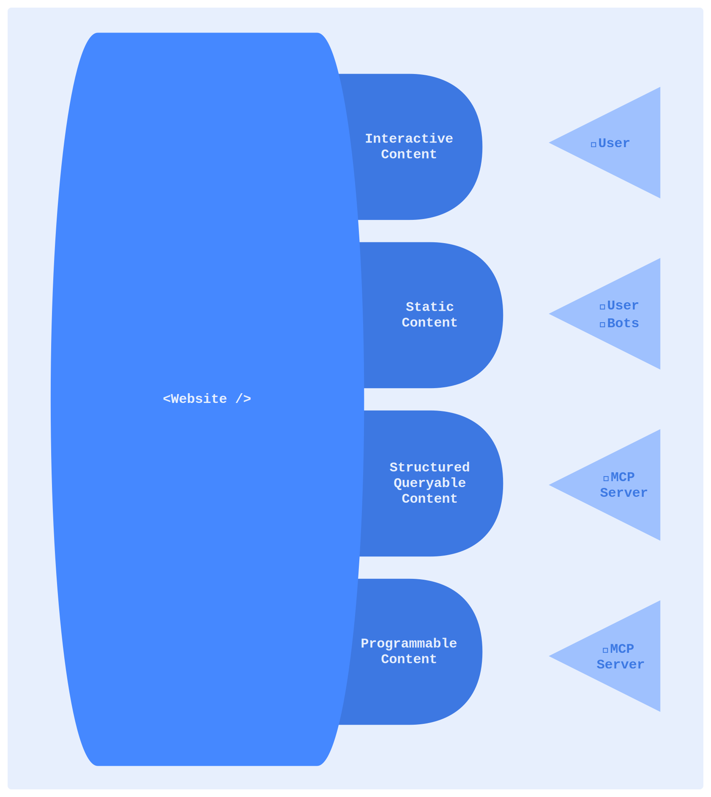
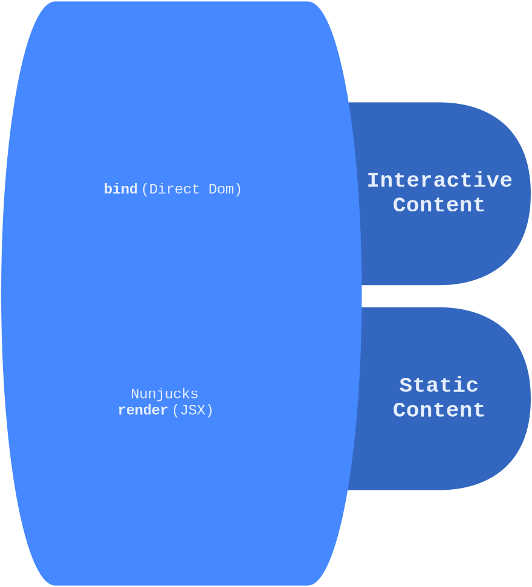

Websites are no longer providers of simple hyperlinked content. The idea, utility and the very definition of a website is changing rapidly. They are now conversational, manipulatable entities. A website of tomorrow is a first-class, active component of a universal knowledge network.

<!--more-->

## A full-featured website of tomorrow

 {.dark-invert}

Websites started out as providers of hyperlinked information to curious users. They became interactive first. As search engines and crawlers surfaced, they were built to surface relevant data in centralized search listing. With LLMs, search engines have been upgraded to become answer engines, providing compressed often clarified information distilled from the information presented in websites. With MCP servers, websites can potentially become conversational and manipulatable interfaces.

How do these evolutionary changes impact how we build websites? The way we build websites has also evolved. We no longer hand code html, frameworks generalized away repetition. LLM based tools like Claude Code allow even what little repetition that is left to be conversationally automated, leaving supervision, guidance, polishing and advanced debugging to the developers.

## Future proofing websites

A key feature of good code has been maintainability &mdash; how easy is it for someone new to make a change to existing code. Looking at where websites and their development are heading, maintainability translates to how easy is it to add or change the website using assistants. This requires not just the existing code, but the code generated by assistants to be self-contained, low complexity and easy to debug.

Our learnings when humans independently maintained the code apply here with tolerance for complexity lowered several rungs.

## How Duct approaches this problem

Duct employs three key old-world adages to serve the new world: separation of concerns, explicit over implicit and reusability through packaging. By getting these foundation right, Duct is setup for addressing the future evolution of websites.

### Separation of concerns

Static content is rendered using markdown and nunjucks templates. The pure `render` function populates the app container with static HTML. Interactive content is brought alive in the `bind` function. You (and the LLM assistants) are offered clear separation of what is static and what is interactive. The [well defined component lifecycle][lifecycle] leaves no doubt on when something is rendered and when it is activated.

[lifecycle]: /blog/2025/08/understanding-duct-lifecycle

 {.dark-invert}

### Explicit over implicit

The `render` function has a single responsibility: to return JSX that shall be rendered in the container as HTML.

The `load` function is reserved for handling asynchronous data loading and network call. The lifecycle makes it explicit that this function is called after the component is rendered and before the `bind` function is called.

The `bind` function exposes the containing DOM element of the component, the return value from load and the component properties passed via JSX. The code in the bind function is self contained and completely defines the interactive features of the component. It also returns the `release` function which shall be called when the component is unloaded.

### Reusability

Duct components are made up of typescript code with JSX. Hence they can be easily packaged into component libraries for re-use. By opting for `nunjucks` templates for page layout and static content, even the page layout can be neatly partitioned using includes.

## Bridging existing tools

Duct's static website generation builds on top of `vite` leveraging its robust plugin architecture and programmatic access through its API. It uses `markdown-it` for rendering static content such as this blog post you are reading.

Duct acts both as conduit and a tape bringing together existing tools and old ideas into the new world with a clean philosophy, well-defined approach and seamless development patterns.

## Conclusion

Strong fundamentals make duct a pleasure to work with when using coding assistants. Despite having a non-existent corpus, Duct works great with [claude code][Claude]. Duct is built today with a far-reaching vision into the future of websites.

[Claude]: /docs/claude-code